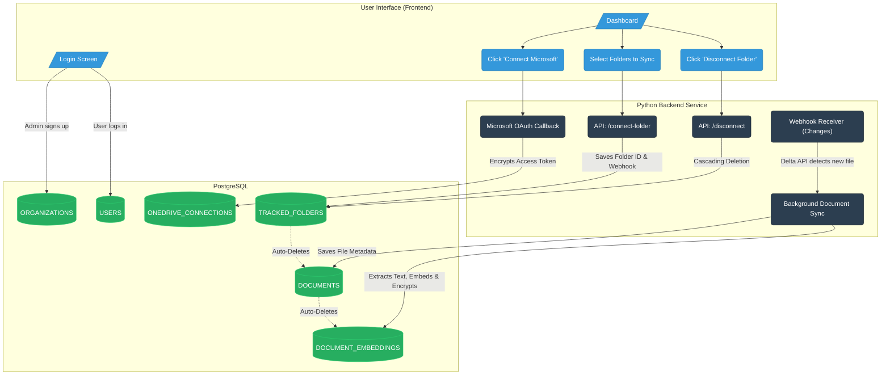

# Database Flow & Structure

Here is the step-by-step flow of how data is securely organized and connected in the database:

### 1. The Core Enterprise (Organization)
Everything starts here. When a company signs up for your product, an **Organization** record is created. It holds their Azure Tenant ID and Client ID. 
*Every single table below is strictly linked back to this Organization to guarantee data isolation (Multi-Tenancy).*

### 2. The People (Users)
Employees belonging to that company are created as **Users** (e.g., admins or members). Each User is firmly linked to their parent Organization.

### 3. The Microsoft Link (OneDrive Connection)
When a User clicks "Connect Microsoft", the system authenticates them and creates a **OneDrive Connection**.
- **Linked to:** The exact User who authenticated it, and the parent Organization.
- **What it holds:** The Microsoft `drive_id`, and crucially, the encrypted OAuth `access_token` and `refresh_token`. It also notes if the app has `full_access` or is limited to `specific_folders`.

### 4. The Chosen Directories (Tracked Folders)
From that OneDrive Connection, the User selects which specific folders the AI is allowed to read. Each selection creates a **Tracked Folder** record.
- **Linked to:** The specific OneDrive Connection, and the parent Organization.
- **What it holds:** The name of the folder, its Microsoft ID, and the vital webhook/delta sync data (`subscription_id`, `delta_link`) used to track live file changes.

### 5. The Discovered Files (Documents)
As your background worker syncs the Tracked Folders, it discovers files (like `.docx` or `.pdf` files) and creates a **Document** record for each file.
- **Linked to:** The specific Tracked Folder it was found in, the OneDrive Connection, and the parent Organization.
- **What it holds:** The file's name, MIME type, size, and Microsoft's last modified timestamp.

### 6. The AI Brain (Document Embeddings)
Finally, when the system reads the actual text inside those Documents, it breaks the text down into small chunks to feed the AI. Each chunk becomes a **Document Embedding** record.
- **Linked to:** The parent Document, the OneDrive Connection, and the Organization.
- **What it holds:** 
  - `chunk_index`: The order of the paragraph in the document.
  - `text_content`: The actual scraped English paragraph (Encrypted).
  - `embedding`: The 1536-dimension mathematical vector representing the text's meaning (stored unencrypted for lightning-fast AI similarity searches).

---

### Key Takeaways of this Flow
- **Security:** If the database is breached, the hackers only see random scrambled text for the OAuth tokens and the document paragraphs. The only readable items are abstract math vectors, file names, and IDs.
- **Cleanliness:** Deleting a folder from the UI cascades downward. Destroying a `Tracked Folder` record instantly obliterates all of its `Documents` and `Document Embeddings` from the database. No cleanup scripts required!

---

## UI to Database Flowchart

This flowchart demonstrates how user actions in the frontend UI map directly to the backend database tables we discussed above.

